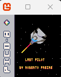
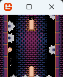
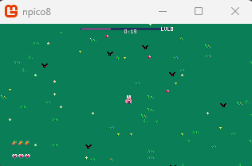
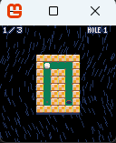

# NPico8
Build retro games in C# with a PICO-8-style powered by MonoGame

Command to publish:

- dotnet publish npico8.csproj -c Release -r win-x64 --self-contained true -p:PublishSingleFile=true

# Games tested using N8

## LastPilot

- https://www.lexaloffle.com/bbs/?pid=169999

## Bas

- https://www.lexaloffle.com/bbs/?tid=54986

## Celeste

- https://www.lexaloffle.com/bbs/?tid=2145

## Bunny

- https://www.lexaloffle.com/bbs/?tid=48032

## Golf 

- https://www.lexaloffle.com/bbs/?tid=38918

